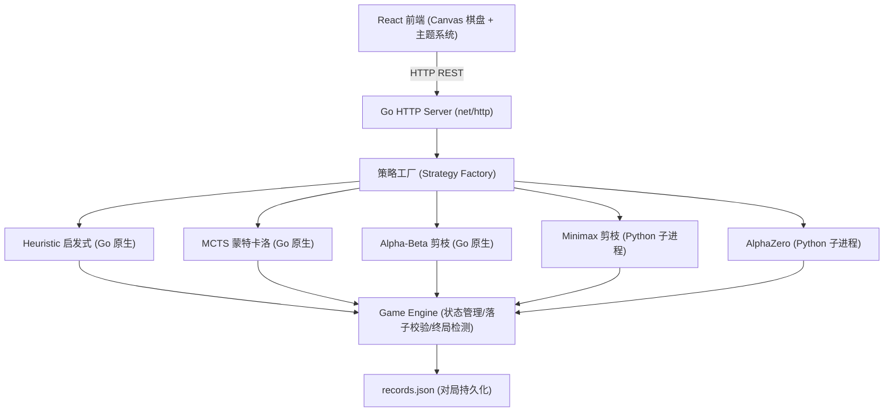
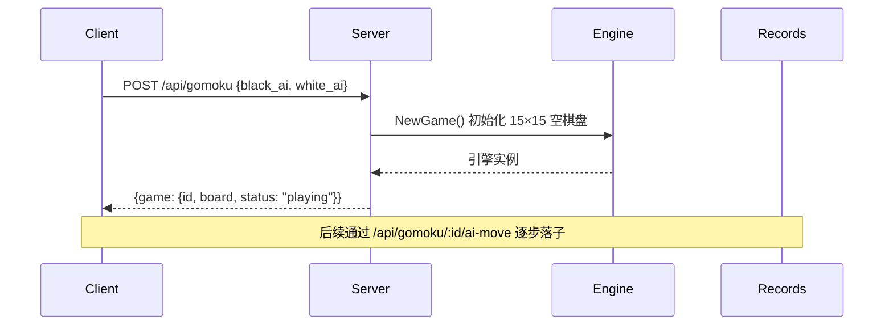
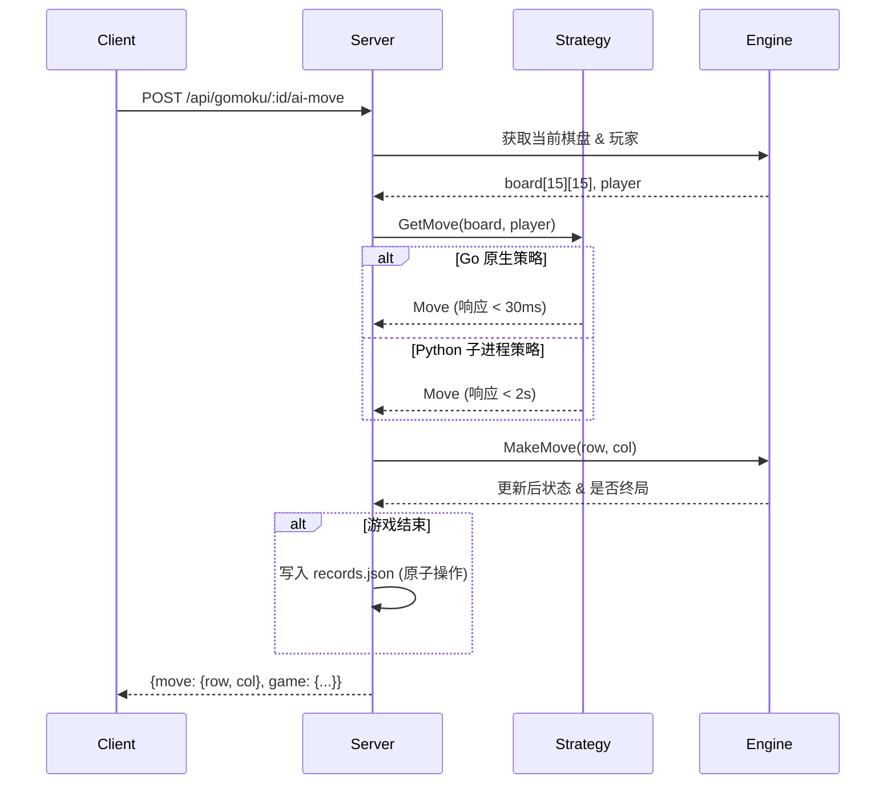

# 五子棋最优策略 —— 实践报告

## 一、项目概述

本小组选题为"游戏的最优策略"，具体研究 **15×15 五子棋（无禁手规则）** 下的 AI 博弈算法。项目从零构建了一个完整的五子棋对战与策略评估平台，集成五种异构 AI 策略，通过双循环锦标赛量化各策略棋力，最终得出该规则下的最优方案。

技术栈遵循"不同语言各司其职"的原则：游戏引擎与 HTTP 服务采用 Go（原生并发，低延迟），前端采用 React + TypeScript + Vite（Canvas 渲染），算法覆盖 Go 原生实现与 Python 深度学习两条路线。项目使用 GitHub 进行版本控制，并支持 Docker 一键部署。

---

## 二、人员组成与分工

| 角色 | 姓名 | 负责内容 |
|------|------|----------|
| 组长 | 余诺 (yn) | 项目架构设计、Go 游戏引擎、HTTP 服务端、React 前端界面、启发式策略、MCTS 策略、Alpha-Beta 策略、Minimax Go 桥接层、AlphaZero Go 桥接层、对局记录系统、Docker 部署、文档编写 |
| 组员 | 黄子懿 (tszyi) | Minimax 剪枝搜索（Python 核心算法）、AlphaZero 深度强化学习（Python 训练脚本 + 推理服务 + ResNet 模型） |

---

## 三、游戏规则与系统设计

### 3.1 游戏规则

- 使用 15×15 棋盘，两名玩家轮流落子（黑子 = 1，白子 = 2）
- 黑方先行，每次在空白交叉点放置一枚棋子
- 任意一方在横、竖、斜任意方向率先形成连续五子即获胜
- 棋盘下满（225 步）仍未分出胜负则为平局
- 本版本未引入禁手规则（三三禁手、四四禁手、长连禁手等）

### 3.2 系统架构

系统采用分层架构，自上而下为：前端表现层 → HTTP API 层 → 策略工厂层 → 游戏引擎层 → 持久化层。

**核心设计原则**：所有 AI 策略通过统一的 Go 接口接入，支持即插即用和任意策略间的自动对战。



### 3.3 策略统一接口

所有策略实现统一接口，Go 原生策略直接在进程内调用，Python 策略通过子进程管道通信桥接。

**Go 侧接口定义**：

```go
type Strategy interface {
    Name() string
    GetMove(board [15][15]int, player int) Move
}
```

**Python 子进程通信方案**：
- Go 服务端通过 `os/exec` 启动 Python 持久子进程
- 采用 JSON Lines 协议（每行一个完整 JSON），stdin 发送请求、stdout 接收响应
- 进程与 Go 服务生命周期一致：首用启动，服务退出时优雅关闭
- 故障隔离：Python 崩溃不影响 Go 服务主体

该方案的优点：避免反复冷启动开销（Python 导入 PyTorch 约需数秒），纯 JSON 序列化无额外中间件依赖，两种语言各自独立维护和调试。

### 3.4 RESTful API 设计

| 方法 | 端点 | 功能 |
|------|------|------|
| `POST` | `/api/gomoku` | 创建新对局，指定黑/白方 AI 类型（"" 表示人类玩家） |
| `POST` | `/api/gomoku/:id/ai-move` | 触发当前方的 AI 自动落子 |
| `PUT` | `/api/gomoku/:id` | 人类玩家落子（提交 row, col） |
| `GET` | `/api/gomoku/:id` | 获取指定对局的完整状态 |
| `GET` | `/api/gomoku` | 列出所有活跃对局 |
| `DELETE` | `/api/gomoku/:id` | 删除指定对局 |
| `GET` | `/api/stats` | 聚合统计（总局数、胜率排行、黑白胜率分布） |
| `GET` | `/api/records?limit=50` | 分页查询历史对局记录 |

对局结束状态由 Game Engine 的事件回调触发，自动写入 `records.json`，采用"临时文件 + `os.Rename`"原子写策略，保证并发场景下的数据完整性。

### 3.5 前端设计

基于 React + TypeScript + Vite 构建的单页应用（SPA）：

- **棋盘渲染**：Canvas 绘制 15×15 网格，支持高 DPI 适配（`devicePixelRatio`），棋子带径向渐变与阴影光泽，最后落子高亮标记便于追踪棋局进展
- **交互模式**：双人对战 / 人机对战（可选执黑或执白）/ AI 自动对战（支持调节落子速度）
- **托管功能**：对局中随时点击"托管"按钮让 AI 接管，再次点击取消
- **四时主题**：「春之呼吸」「秋日郊野」「寒冬低语」「繁星守望」四种配色，CSS 变量驱动一键切换
- **诗句轮播**：棋盘两侧各有一列古风诗句沿竖向轨道 CSS 动画循环滚动，色彩随主题自动变换
- **全局文字不可选中**：营造沉浸式的专注对弈体验
- **通信方式**：通过 Vite 开发代理将 `/api` 请求转发至 Go 后端 `localhost:8080`

---

## 四、算法设计与实现

### 4.1 暴力搜索的不可行性

项目初期我们探讨了两种暴力路线：

1. **穷举博弈树**：对 15×15 棋盘，分支因子开局约 225，博弈树规模远超桌面计算能力（每秒约 10^9~10^10 次节点评估），完全不可行。
2. **预存储胜利棋谱**：经粗略估算，所有合法棋局的数量远超可观测宇宙的原子数（约 10^80），数据库路线在物理上不可能。

因此必须转向启发式搜索与学习型方法。

---

### 4.2 启发式规则策略（Heuristic）

**原理**：基于人工设计的棋型评分表，识别活四、冲四、活三、眠三等棋型并打分，在候选位置中选择综合评分最高的落子。

**棋型评分表**：

| 棋型 | 分值 | 说明 |
|------|------|------|
| 五连 | 100,000 | 直接获胜，最高优先级 |
| 活四 | 10,000 | 两端均空，不可防守，必胜 |
| 冲四 | 1,000 | 一端被封，仍需立即应对 |
| 活三 | 500 | 两端均空，潜在威胁 |
| 冲三 | 100 | 一端被封的威胁 |
| 活二 | 50 | 基础发展态势 |

**决策流程（双阶段）**：

1. **候选生成**：仅考虑已有棋子周围曼哈顿距离 ≤ 2 的空位，将候选集大幅压缩
2. **评分排序**：对每个候选位置分别计算己方进攻评分和对方防守评分，按动态权重合成最终分数，选最高分落子

**实测表现**：

| 指标 | 数据 |
|------|------|
| 平均响应时间 | < 1 ms |
| 综合胜率 | 54.3%（19胜 12负 4平） |
| 执黑胜率 | 94%（15胜 1负） |
| 执白胜率 | 27%（4胜 11负） |
| 对 Alpha-Beta | 全胜（8-0） |

**分析**：启发式策略在执黑时几乎无敌（94%），但执白时攻击性不足，后手劣势明显。这是基于规则的策略的通病——评分权重是人工设定的，难以自适应地调整攻防节奏。

---

### 4.3 MCTS 蒙特卡洛树搜索

**原理**：通过大量随机模拟（Rollout）来近似各走法的期望胜率。每轮迭代包含四个阶段：

1. **选择（Selection）**：从根节点出发，用 PUCT 公式平衡探索与利用，选出最有价值的子节点
2. **扩展（Expansion）**：在到达的叶节点上展开候选走法
3. **模拟（Simulation）**：从新节点出发，用启发式优先级链快速模拟至终局
4. **回传（Backpropagation）**：将模拟结果沿路径反向传播，更新各节点的胜负统计

**关键优化**：

- **候选过滤**：仅考虑已有棋子周围 2 格，避免在空旷区域浪费模拟次数
- **启发式 Rollout**：模拟时按优先级选点——己方五连 > 堵对方五连 > 活四 > 冲四 > 活三 > ...，比纯随机模拟收敛更快
- **模拟次数**：500 次/步，在精度和响应时间之间取得平衡

**实测表现**：

| 指标 | 数据 |
|------|------|
| 平均响应时间 | < 5 ms（500次模拟） |
| 综合胜率 | 55.9%（19胜 9负 6平） |
| 执黑胜率 | 77% |
| 执白胜率 | 60% |
| 负场数 | 9 场（全部策略中最少） |
| 平局数 | 6 场（全部策略中最多） |

**分析**：MCTS 是本项目中防守韧性最强的策略——仅输 9 场，且执白胜率 60% 远超其他策略。这得益于随机模拟天然具备的不确定性建模能力：即便处于被动局面，大样本模拟仍能发现最优防守路径。MCTS 也是唯一实现先/后手胜率均衡的策略（77% vs 60%）。纯 Go 实现、零外部依赖、毫秒级响应也使其最适合实战部署。

---

### 4.4 Alpha-Beta 博弈树搜索（Go 版）

**原理**：采用 Negamax 形式的 Alpha-Beta 剪枝搜索，递归深度 d = 4，由迭代加深框架控制，单步时限 2 秒。

**核心优化**：

- **11 类棋型精确识别**：五连 / 活四 / 冲四 / 活三 / 冲三 / 活二 / 冲二 / 双四 / 四三 / 双三 / 眠三
- **杀手启发式（Killer Heuristic）**：存储各深度层触发 Beta 剪枝的走法，优先评估
- **历史启发式（History Heuristic）**：基于走法历史剪枝效率进行排序
- **紧急局面自适应加深**：检测到冲四/活三级威胁时动态增加搜索深度

**实测表现**：

| 指标 | 数据 |
|------|------|
| 中盘响应时间 | ~30 ms（depth = 4） |
| 综合胜率 | 6.1%（2胜 31负 0平） |
| 对 Minimax（同为 depth=4） | 全败（0-8） |

**败因分析**：这是本项目中最值得反思的一个案例。Alpha-Beta 胜率仅 6.1%，并非因为 Alpha-Beta 算法本身的问题，而是因为：

1. **Depth = 4 太浅**：在 15×15 棋盘上，4 层深度只够看到 2 步棋，搜索视野严重不足
2. **缺少静态搜索（Quiescence Search）**：搜索在固定深度截止时可能停在"看似有利但下一步就被杀"的局面，即所谓的地平线效应。同 depth = 4 的 Python Minimax 正是凭借静态搜索 + 更精细的评估函数以 8-0 完胜
3. **评估函数权重标定不够精准**：对活三/冲四等威胁性棋型的判断权重需要进一步调优

**教训**：在博弈树搜索中，评估函数的精细度（包括静态搜索）与搜索深度同等重要，甚至更为关键。

---

### 4.5 Minimax 剪枝搜索（Python 版）

**原理**：Negamax + Alpha-Beta 剪枝 + 静态搜索，Python 实现。通过 Go 端管理持久子进程进行管道通信。

**与 Go 版 Alpha-Beta 的关键区别**：

- **静态搜索**：评估函数返回前，若局面估值超过冲四阈值，则额外展开一层搜索（只考虑迫选走法），有效消除地平线效应
- **精细评估函数**：在棋型识别基础上增加位置权重（中心偏好）和动态威胁判定
- **候选过滤**：候选走法限定在已有棋子曼哈顿距离 ≤ 2 的范围内
- **走法排序**：己方五连 > 堵对方五连 > 靠近中心。预计算 NumPy 数组加速邻近位置和中心权重的查找

**通信协议**（Go ↔ Python 子进程，stdin/stdout JSON Lines）：

请求：
```json
{"board": [[0,0,...], ...], "player": 1, "depth": 4}
```

响应：
```json
{"row": 7, "col": 7, "score": 450.0, "nodes": 125000}
```

**实测表现**：

| 指标 | 数据 |
|------|------|
| 综合胜率 | 53.1%（17胜 14负 1平） |
| 响应时间 | < 2 秒 |
| 执黑胜率 | 81% |
| 执白胜率 | 27% |
| 对 Alpha-Beta (Go) | 全胜（8-0） |

**分析**：Minimax 与 Alpha-Beta 同为 depth = 4，但战绩天差地别（8-0），充分证明了静态搜索和高质量评估函数的决定性价值。执白表现仍不够理想（27%），说明即便加了静态搜索，搜索深度对后手局面来说依然偏浅。

---

### 4.6 AlphaZero 深度强化学习

**原理**：采用 AlphaZero 范式——基于 ResNet 的双头神经网络（策略头 + 价值头）+ MCTS 搜索。

**网络结构**：
- **共享层**：3 层残差块（256 通道，3×3 卷积，BatchNorm + ReLU）
- **策略头（Policy Head）**：卷积 → 全连接 → Softmax，输出 225 维落子概率分布
- **价值头（Value Head）**：卷积 → 全连接 → Tanh，输出 [-1, 1] 标量，表示当前局面的预估胜率

**训练流程**：
1. **自对弈数据生成**：使用当前最优 checkpoint + MCTS（800 次模拟）生成训练样本
2. **损失函数**：同时优化价值预测误差（MSE）和策略匹配误差（交叉熵）
3. **训练参数**：SGD with momentum，初始学习率 0.01，batch size 512
4. **模型存储**：checkpoint_11.pth.tar（185 MB，Git LFS 托管）

**推理部署**：与 Minimax 策略一致，Go 端启动 Python 持久子进程。推理阶段使用策略头的落子概率输出指导 MCTS 搜索。每次前向传播 < 50 ms（CPU 模式）。

**实测表现**：

| 指标 | 数据 |
|------|------|
| 综合胜率 | 62.5%（20胜 11负 1平）——锦标赛第 1 名 |
| 执黑胜率 | 88% |
| 执白胜率 | 40% |
| 对 Heuristic | 全胜（8-0） |
| 对 Minimax | 全胜（8-0） |
| 对 Alpha-Beta | 全胜（8-0） |
| 对 MCTS | 2胜 2负（旗鼓相当） |

**分析**：AlphaZero 的 62.5% 胜率验证了深度强化学习在五子棋中的有效性。但负场数（11 场）多于 MCTS（9 场），表明在有限训练轮次（11 个 checkpoint）下，神经网络的估值噪声可能导致局部决策失误。值得注意的是，AlphaZero 对 MCTS 仅 2 胜 2 负，两强相遇难分伯仲。

---

## 五、策略锦标赛

### 5.1 赛制设计

为客观评估各策略的真实棋力并消除先手偏差，我们设计了双循环锦标赛：

- **对阵组合**：5 种策略两两配对，共 10 组
- **轮次设计**：每组对阵 4 局，双方各执黑 2 局、执白 2 局，共 40 组对阵
- **总对局量**：40 × 2 方向 = 80 场（另含 3 场历史验证对局，合计 83 场）
- **数据存储**：全部对局记录持久化至 `records.json`，通过 `/api/stats` 提供实时统计

### 5.2 对战矩阵

矩阵元素 `(行策略, 列策略)` 表示行策略执黑、列策略执白时的战绩（黑胜 / 白胜 / 平局）：

```
黑 vs 白     Heuristic      MCTS      AlphaBeta   AlphaZero   Minimax
------------------------------------------------------------------------
Heuristic         --     2B/1W/2D     4B/0W/0D    4B/0W/0D    4B/0W/0D
MCTS          2B/0W/2D         --     4B/1W/0D    1B/2W/1D    3B/0W/1D
AlphaBeta     0B/4W/0D     1B/3W/0D         --     0B/4W/0D    0B/4W/0D
AlphaZero     4B/0W/0D     2B/2W/0D     4B/0W/0D         --     4B/0W/0D
Minimax       4B/0W/0D     1B/3W/0D     4B/0W/0D    4B/0W/0D         --
```

### 5.3 最终排名

| 排名 | 策略 | 胜 | 负 | 平 | 总局 | 胜率 | 执黑胜率 | 执白胜率 |
|------|------|----|----|----|------|------|----------|----------|
| 1 | AlphaZero | 20 | 11 | 1 | 32 | 62.5% | 88% | 40% |
| 2 | MCTS | 19 | 9 | 6 | 34 | 55.9% | 77% | 60% |
| 3 | Minimax | 17 | 14 | 1 | 32 | 53.1% | 81% | 27% |
| 4 | Heuristic | 19 | 12 | 4 | 35 | 54.3% | 94% | 27% |
| 5 | Alpha-Beta | 2 | 31 | 0 | 33 | 6.1% | -- | -- |

### 5.4 锦标赛核心结论

**结论一：先手优势极为显著**

在无禁手规则下，所有策略执黑胜率均远超执白胜率。Heuristic 执黑胜率高达 94%（15 胜 1 负），几乎先手必胜。这一规律表明，若要追求五子棋的竞技公平性，引入禁手规则或均衡开局是必要条件。

**结论二：MCTS 是防守最稳健的策略**

MCTS 仅输 9 场，负场数为全策略最少，且执白仍有 60% 胜率。在面对强敌 AlphaZero 时打成 2 胜 2 负。其稳定性源于随机采样天然具备的不确定性建模能力——不是搜索"最好"的走法，而是搜索"最不容易出错"的走法。

**结论三：评估函数质量 > 搜索深度**

Go 版 Alpha-Beta 与 Python 版 Minimax 同为 depth = 4，Minimax 凭借静态搜索 + 更精细的评估函数以 8-0 完胜。这说明在有限的搜索预算下，把钱花在"评估得准"上比花在"搜得深"上更划算。

**结论四：深度学习对上传统算法构成碾压**

AlphaZero 对 Heuristic（规则）、Minimax（搜索）、Alpha-Beta（搜索）三策略保持全胜（各 8-0），充分展示了从数据中学习棋型特征的优势。但 AlphaZero 与 MCTS 的对战仅为 2 胜 2 负，说明传统搜索在特定条件下仍可与深度学习抗衡。

**结论五：混合策略潜力巨大**

Heuristic 执黑 94% + MCTS 执白 60% 形成互补组合。如果将两者按对局阶段动态融合（开局 Heuristic 抢攻，残局 MCTS 稳守），有望超越单一策略的天花板。

### 5.5 算法性能全景对比

| 维度 | Heuristic | MCTS | Alpha-Beta | Minimax | AlphaZero |
|------|-----------|------|------------|---------|-----------|
| 响应速度 | < 1 ms | < 5 ms | ~30 ms | < 2 s | < 2 s |
| 实现语言 | Go | Go | Go | Python | Python |
| 外部依赖 | 无 | 无 | 无 | NumPy | PyTorch |
| 模型体积 | -- | -- | -- | ~10 MB | ~185 MB |
| 训练需求 | 无 | 无 | 无 | 无 | GPU 训练 |
| 可解释性 | 高 | 中 | 中 | 中 | 低 |
| 执黑胜率 | 94% | 77% | -- | 81% | 88% |
| 执白胜率 | 27% | 60% | -- | 27% | 40% |
| 综合胜率 | 54.3% | 55.9% | 6.1% | 53.1% | 62.5% |

---

## 六、工程实施细节

### 6.1 技术栈选型

| 层级 | 技术选型 | 选型理由 |
|------|----------|----------|
| 游戏引擎 | Go 1.26 | 原生并发模型、高效内存管理 |
| HTTP 服务 | Go net/http | 标准库零依赖，性能优于 Python Flask |
| 前端 | React + TypeScript + Vite | 类型安全、按需编译、Canvas 渲染 < 16ms |
| Go 算法 | 原生实现 | 毫秒级响应，无 IPC 开销 |
| Python 算法 | 子进程管道 | 利用 PyTorch 生态，JSON Lines 桥接 |
| 容器化 | Docker + docker-compose | 环境一致性、一键部署 |

### 6.2 核心流程

**创建对局流程**：



**AI 落子流程**：



### 6.3 Docker 部署

```yaml
# docker-compose.yml
services:
  backend:
    build: .
    ports:
      - "8080:8080"
    volumes:
      - ./records.json:/app/records.json
  frontend:
    build: ./frontend
    ports:
      - "5173:5173"
    depends_on:
      - backend
```

一键启动：`docker-compose up --build`

---

## 七、经验总结与改进方向

### 7.1 工程经验

1. **Go + Python 分工是可行的**：Go 负责低延迟服务（< 5ms）和原生策略，Python 负责深度学习方案的训练和推理，子进程管道通信的开销在可接受范围内（< 2s）。两种语言各自在擅长的领域发挥了最大价值。

2. **策略评估必须系统化**：双循环锦标赛有效消除了单边对战中的先手偏差。如果不轮换执黑执白，仅凭几场对战得出的"某策略更强"的结论可能是不可靠的。

3. **Alpha-Beta 的反面教材价值**：Go 版 Alpha-Beta 的惨败告诉我们，搜索深度不是万能药——评估函数的精度和静态搜索的有无比深度数字更加重要。这个教训在后续调优中至关重要。

4. **深度学习的部署成本不容忽视**：AlphaZero 虽棋力最强，但 185 MB 的模型文件 + PyTorch 依赖使其部署复杂度远高于纯 Go 方案。在追求棋力的同时，需权衡实际部署的便利性。

### 7.2 改进方向

1. **混合策略**：根据对局阶段（开局/中盘/残局）自适应切换策略。例如开局用 Heuristic 抢攻建立优势，中后盘切换 MCTS 稳健防守。

2. **AlphaZero 继续训练**：当前仅训练了 11 个 checkpoint，增加自对弈轮次和模型容量有望进一步提升棋力。

3. **引入禁手规则**：在引擎层扩展三三禁手、四四禁手、长连禁手的合法性校验，研究禁手规则下先手优势是否能得到有效抑制。

4. **Alpha-Beta 改进**：添加静态搜索、优化棋型权重、增加搜索深度至 6-8 层，预期能将棋力提升至接近 Minimax 甚至更优水平。

5. **分布式评测**：将策略锦标赛扩展至多机并行执行，缩短大规模评估周期。

---

*完整项目代码、对局数据及训练日志参见 [GitHub 仓库](https://github.com/ContinueYN/GomokuMind)*
